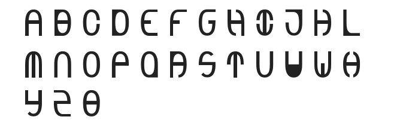

# Arial Zero an SVG font based on the 0 character in Arial.

I wanted to try my hand at creating an SVG font. This was my initial attempt to create something functional from a font project I recently completed.

This is currently untested, but I want to make improvements to it as time allows.

Check it out the result below:

